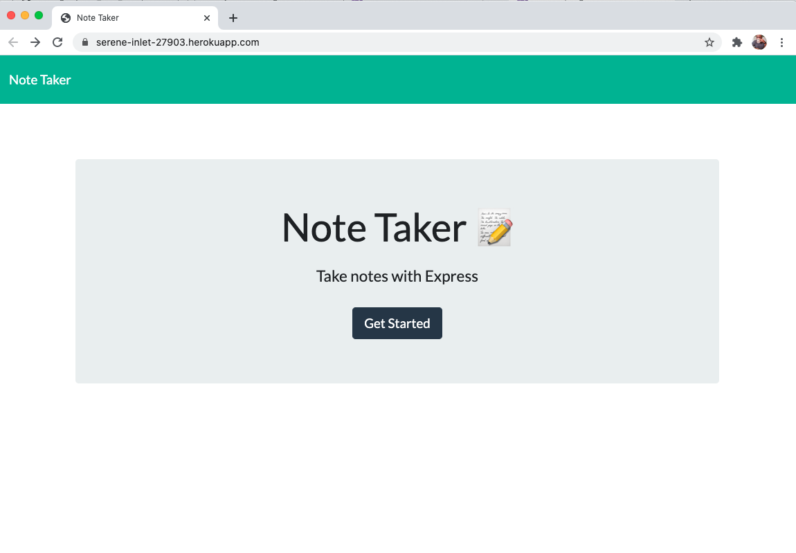
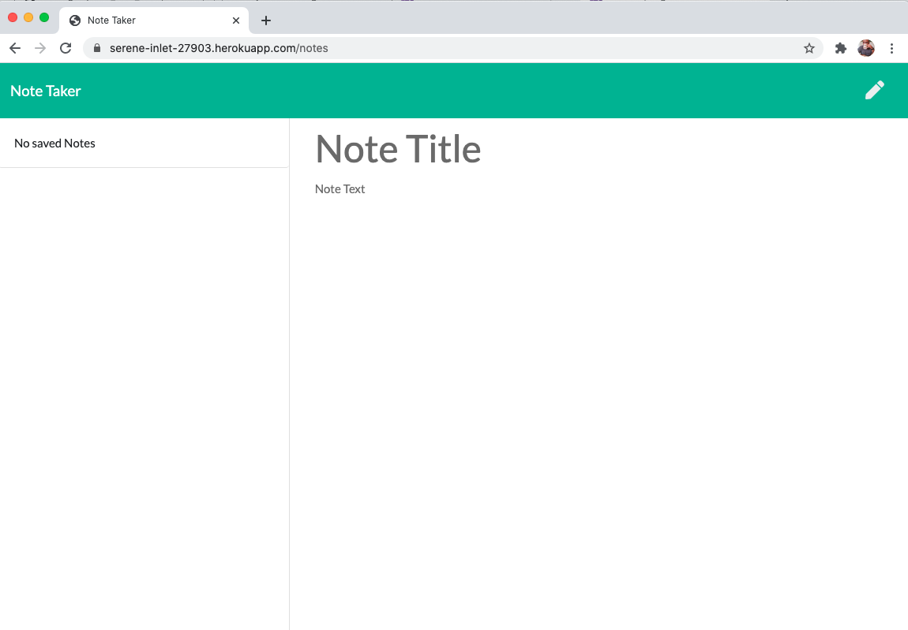

# express_note_taker
271715LSEP2020
Deployed app:
https://serene-inlet-27903.herokuapp.com/

This is a small app that allows the user to create, save, and delete notes.

In this assignment, the front-end coding was already provided and complete.  The assignment was to get the app to work on a server, in this case we used Heroku.

To deploy the app locally, you'll need to run npm install.

Here's the final product:

Day-to-day progress of the GitHub commits:
271658LSEP2020
Deployed the app to Heroku:
https://serene-inlet-27903.herokuapp.com/

271525LSEP2020
Finished the project locally, using localhost:8080.  Uploaded files to GitHub; will deploy on Heroku.  If I don't come back, tell my momma I tried.

24xxxxLSEP2020
Added .gitignore file

21xxxxLSEP2020
Initial commit; uploaded files; created README.
